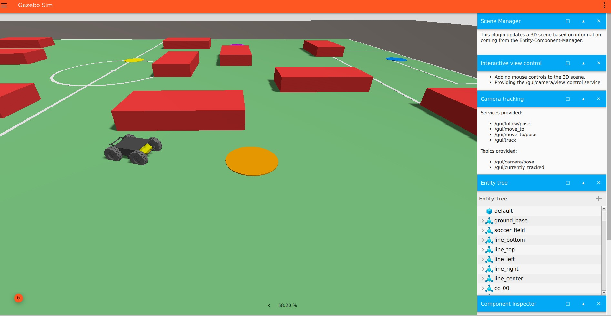

# SEN771 AGVC — Path Planning Simulation with ROS 2 + Gazebo

**Student:** Dexter Leong | s223026243  
**Unit:** SEN771 Intelligent Autonomous Robots, T1 2026

---

## What This Project Does

A Husky A200 robot navigates a randomly generated 120 × 90 m soccer field in Gazebo Ionic.
Before each run the user clicks four target locations on an interactive map.
The robot then visits all four targets in the optimal order and returns to start.

Key features:
- **User-selectable targets**: click 4 points on a matplotlib field preview; Gazebo spawns coloured disc markers exactly where you clicked
- **TSP optimisation**: brute-force 4! = 24 permutations finds the shortest round-trip visit order before any path is planned
- **Four path planning algorithms**: A\*, BFS, RRT, and Theta\* each plan the full route independently; the robot drives all four back-to-back for comparison
- **Pure Pursuit controller**: 50 Hz control loop with adaptive look-ahead; slows to 0.2 m/s within 1 m of each target
- **Stop / wait / turn at every target**: robot fully stops inside each disc, pauses, then rotates to face the next outgoing direction before continuing
- **Whole-car detection**: trigger fires only when the entire 3.0 × 1.7 m chassis is inside the 2.0 m-radius disc (centre-to-centre ≤ 0.3 m)



---

## System Requirements

| Requirement | Version |
|---|---|
| OS | Ubuntu 24.04 |
| ROS 2 | Jazzy |
| Gazebo | Ionic (Harmonic) |
| Python | 3.12 (system, **not** conda) |

---

## Quick Start

### 1 — Install (first time only)

```bash
sudo apt update
sudo apt install -y ros-jazzy-desktop ros-jazzy-ros-gz python3-colcon-common-extensions
echo "source /opt/ros/jazzy/setup.bash" >> ~/.bashrc && source ~/.bashrc
```

### 2 — Clone and build

```bash
mkdir -p ~/ros2_ws/src && cd ~/ros2_ws/src
git clone https://github.com/dexterl433/Path_Planning_Simulation_with_Gazebo_Dex.git sen771_agvc
cd ~/ros2_ws

# IMPORTANT — see conda warning below before running this
PATH=/usr/bin:/usr/local/bin:/bin colcon build --packages-select sen771_agvc --symlink-install
source install/setup.bash
```

### 3 — Run

```bash
ros2 launch sen771_agvc sen771.launch.py
```

A matplotlib window opens showing the field and randomly placed obstacles.
**Click four target locations** on the field (avoid red obstacles).
Close the window. Gazebo loads with your chosen targets as coloured discs, and the robot starts planning.

---

## Launch Options

| Argument | Default | Description |
|---|---|---|
| `obs_size:=6` | 6 | Obstacle base size in metres (obstacles are randomly tall or wide multiples of this) |
| `autostart:=false` | true | Start Gazebo paused; press Play to begin |
| `rviz:=true` | false | Open RViz2 alongside Gazebo |
| `run_planner:=false` | true | Launch Gazebo without starting the planner node |

Example:
```bash
ros2 launch sen771_agvc sen771.launch.py obs_size:=8 rviz:=true
```

---

## Algorithms Implemented

All four algorithms solve the same TSP-ordered multi-target route. Each segment is planned independently then concatenated.

| Algorithm | Type | Notes |
|---|---|---|
| **A\*** | Informed search | Heuristic = Euclidean distance; 4-connected grid; optimal on grid |
| **BFS** | Uninformed search | Explores all directions equally; guarantees shortest grid path but slower than A\* |
| **RRT** | Sampling-based | 15% goal bias; step size 4 cells; probabilistically complete |
| **Theta\*** | Any-angle A\* | Parent-linking shortcut: if grandparent has line-of-sight to neighbour, skip the current node and connect directly with Euclidean cost, producing smooth diagonal paths without post-processing |

After planning, the robot drives each algorithm's path in sequence. A\*, BFS, and RRT paths are simplified first (greedy line-of-sight waypoint reduction). Theta\* runs raw; it is already any-angle.

---

## How the Pipeline Works

```
launch file
  │
  ├─► generate_world.py  (blocking — runs first)
  │     ├─ generates 15 random obstacles (safe spacing, clear of start)
  │     ├─ shows matplotlib click UI → user picks 4 target coordinates
  │     ├─ deletes any stale /tmp/sen771_*.json files
  │     ├─ writes /tmp/sen771_world.sdf   (Gazebo world with dynamic targets)
  │     ├─ writes /tmp/sen771_obstacles.json
  │     └─ writes /tmp/sen771_targets.json
  │
  ├─► Gazebo Ionic  (loads generated world)
  ├─► ros_gz_bridge (cmd_vel ↔ odometry ↔ ground-truth pose)
  └─► planner_node.py
        ├─ waits for Gazebo odometry (confirms world is loaded)
        ├─ re-reads both JSON files (race-condition fix — see bugs section)
        ├─ builds 120×90 occupancy grid (3-cell obstacle inflation + 5-cell boundary)
        ├─ TSP brute-force (4! = 24) → optimal target visit order
        ├─ plans A*, BFS, RRT, Theta* paths (tracks wall time, CPU time, memory)
        └─ drives each algorithm → stops / waits / turns at every target disc
```

---

## Target Behaviour Detail

When the robot reaches a target disc:
1. Detection fires at ≤ 0.3 m centre-to-centre (guarantees whole 3.0 × 1.7 m chassis is inside the 2.0 m-radius disc)
2. Full stop (`cmd_vel = 0`)
3. 1-second pause
4. Spin in place until heading is within 5° of the outgoing path direction
5. Resume Pure Pursuit toward the next target

Approach speed ramps from cruise (10 m/s) down to 0.2 m/s at 0.8 m from the disc centre, using the formula `max(0.2, distance × 0.25)` m/s.

---

## Output Files

After each run the planner saves plots to `~/ros2_ws/`:

| File | Contents |
|---|---|
| `sen771_planned_paths.png` | All four planned paths on the field with TSP order labels |
| `sen771_actual_vs_planned.png` | Planned path vs actual GPS trace for each algorithm |
| `sen771_path_simplification.png` | Raw grid path vs simplified waypoints |
| `sen771_efficiency.png` | Bar charts: path length, deviation, waypoints, nodes explored |
| `sen771_results_table.png` | Numeric comparison table: time, memory, path length, deviation |

---

## MATLAB Prototype

`matlab/SEN771_Project.m` implements the same four algorithms (A\*, BFS, RRT, Theta\*) and TSP solver in pure MATLAB, with no ROS 2 or Gazebo required.
Open in MATLAB R2021a or later and run the script directly.

The MATLAB version uses fixed hardcoded obstacles and targets for reproducibility. The ROS 2 version uses randomly generated obstacles and user-clicked targets for each run.

---

## Known Bugs and Fixes Applied

### 1 — Miniconda / Anaconda Python version mismatch

**Problem:** ROS 2 Jazzy requires Python 3.12 (system). If Miniconda or Anaconda is installed, `python3` and `colcon` may resolve to Python 3.13 (conda). Running `colcon build` with the wrong Python produces `.pyc` bytecode for 3.13, but the planner entry point (`#!/usr/bin/python3`) uses system Python 3.12. The compiled package is silently ignored and the node falls back to whatever is in `site-packages`.

**Fix:** Prepend the system binary paths before building:
```bash
PATH=/usr/bin:/usr/local/bin:/bin colcon build --packages-select sen771_agvc --symlink-install
```

### 2 — Stale `site-packages` copy not updated by `--symlink-install`

**Problem:** `colcon build --symlink-install` symlinks the package in the *build* directory to the source, but copies the Python files into the *install* `site-packages/` directory. Edits to source after the initial build are not reflected; the node keeps running the old copy.

**Fix:** Replace the physical copies with symlinks after building:
```bash
SRC=~/ros2_ws/src/sen771_agvc/sen771_agvc/planner_node.py
ln -sf "$SRC" ~/ros2_ws/install/sen771_agvc/lib/python3.12/site-packages/sen771_agvc/planner_node.py
```
Alternatively, re-run `colcon build` after any source change.

### 3 — Race condition: planner reads stale JSON before Gazebo writes it

**Problem:** The launch file starts Gazebo and the planner in parallel. The planner's module-level code ran at Python import time — before `generate_world.py` had finished writing the JSON target files — so it read stale positions from a previous run (or the hardcoded fallback).

**Fix:** `planner_node._run()` re-reads both JSON files *after* receiving the first odometry message from Gazebo. Odometry can only arrive after Gazebo finishes loading the world, which only happens after `generate_world.py` has exited — guaranteeing the JSON is fresh.

### 4 — Stale JSON from a failed previous run

**Problem:** If `generate_world.py` crashed after writing the obstacle JSON but before writing the target JSON, the next run would pick up the old target file.

**Fix:** `generate_world.py` deletes both `/tmp/sen771_obstacles.json` and `/tmp/sen771_targets.json` at startup, before generating anything. If it crashes mid-run, missing files trigger the clearly-labelled hardcoded fallback in the planner.

---

## Folder Structure

```
sen771_agvc/
├── matlab/
│   └── SEN771_Project.m           ← MATLAB prototype: A*, BFS, RRT, Theta*, TSP
├── scripts/
│   └── generate_world.py          ← obstacle generator + click-to-place target UI
├── launch/
│   └── sen771.launch.py           ← main launch file (blocks on generate_world.py)
├── sen771_agvc/
│   ├── planner_node.py            ← occupancy grid, TSP, path planning, Pure Pursuit
│   ├── monitor_node.py            ← live terminal status display
│   ├── debug_node.py              ← topic inspector / debug helper
│   └── __init__.py
├── worlds/
│   ├── sen771_world_template.sdf  ← field + robot SDF; {OBSTACLES} and {TARGETS} injected at launch
│   └── sen771_world.sdf           ← fallback static world (used if generate_world.py fails)
├── rviz/
│   └── sen771.rviz
├── images/
├── package.xml
├── setup.py
└── setup.cfg
```

---

## Stop the Simulation

```bash
pkill -f gz_sim; pkill -f planner; pkill -f parameter_bridge
```

---

## Credits

| Resource | Source |
|---|---|
| Husky A200 robot meshes | [Clearpath Robotics, clearpath_common](https://github.com/clearpathrobotics/clearpath_common) |
| ROS 2 ↔ Gazebo bridge | [gazebosim/ros_gz](https://github.com/gazebosim/ros_gz) |
| ROS 2 Jazzy | [ros2/ros2](https://github.com/ros2/ros2) |
| Gazebo Ionic | [gazebosim/gz-sim](https://github.com/gazebosim/gz-sim) |
| Pure Pursuit reference | Coulter, R.C. (1992), CMU Robotics Institute |
| Theta\* reference | Daniel et al. (2010), *Theta\*: Any-Angle Path Planning* |

All path planning algorithms, TSP solver, occupancy grid, Pure Pursuit controller, world generator, and click-to-place target UI written from scratch for this assignment.

---

## Windows / WSL2 Fresh Setup

If setting up from scratch on Windows:

### Install WSL2 + Ubuntu 24.04

```powershell
# PowerShell (Administrator)
wsl --install -d Ubuntu-24.04
```

Restart, then open Ubuntu 24.04 from the Start Menu.

### Install ROS 2 + Gazebo

```bash
sudo apt update && sudo apt upgrade -y
sudo apt install -y curl software-properties-common
sudo add-apt-repository universe

sudo curl -sSL https://raw.githubusercontent.com/ros/rosdistro/master/ros.key \
  -o /usr/share/keyrings/ros-archive-keyring.gpg
echo "deb [arch=$(dpkg --print-architecture) signed-by=/usr/share/keyrings/ros-archive-keyring.gpg] \
  http://packages.ros.org/ros2/ubuntu noble main" \
  | sudo tee /etc/apt/sources.list.d/ros2.list

sudo apt update
sudo apt install -y ros-jazzy-desktop ros-jazzy-ros-gz python3-colcon-common-extensions
echo "source /opt/ros/jazzy/setup.bash" >> ~/.bashrc && source ~/.bashrc
```

### Clone, build, run

```bash
mkdir -p ~/ros2_ws/src && cd ~/ros2_ws/src
git clone https://github.com/dexterl433/Path_Planning_Simulation_with_Gazebo_Dex.git sen771_agvc
cd ~/ros2_ws
PATH=/usr/bin:/usr/local/bin:/bin colcon build --packages-select sen771_agvc --symlink-install
source install/setup.bash
ros2 launch sen771_agvc sen771.launch.py
```

WSLg handles the display automatically on Windows 11. No X server setup is needed.

### Optional: Increase WSL2 resources

Create `C:\Users\<YourName>\.wslconfig`:
```ini
[wsl2]
processors=8
memory=10GB
swap=8GB
```
Then run `wsl --shutdown` in PowerShell and relaunch Ubuntu.
